<!--
Shivam Negi - GitHub profile README
Username: shivam01112
Built as a visual frontend engineering dashboard with local SVG animation assets.
-->

  

 

  
  
  

 

  

 

  

 

  

 

  

 

  <picture>
    <source media="(prefers-color-scheme: dark)" srcset="./assets/github-contribution-snake-dark.svg" />
    <source media="(prefers-color-scheme: light)" srcset="./assets/github-contribution-snake.svg" />
    
  </picture>

 

  
  
  

 

  

