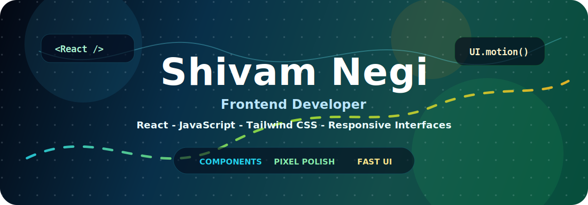
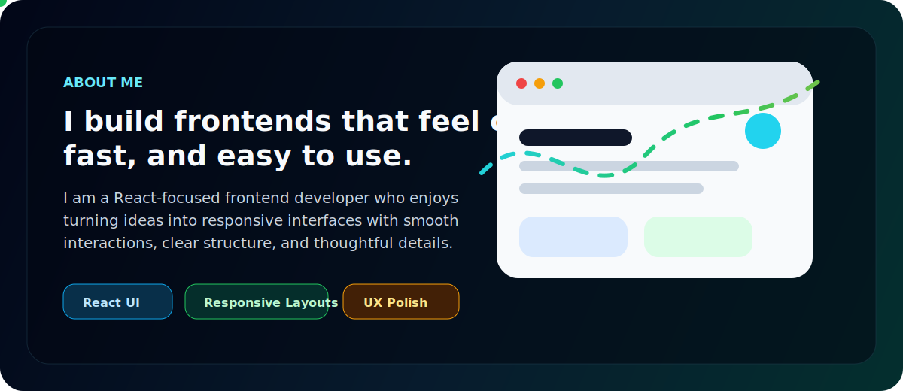
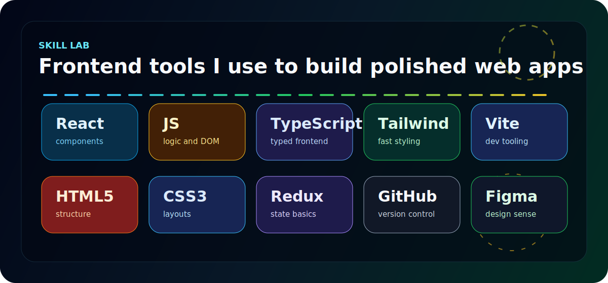
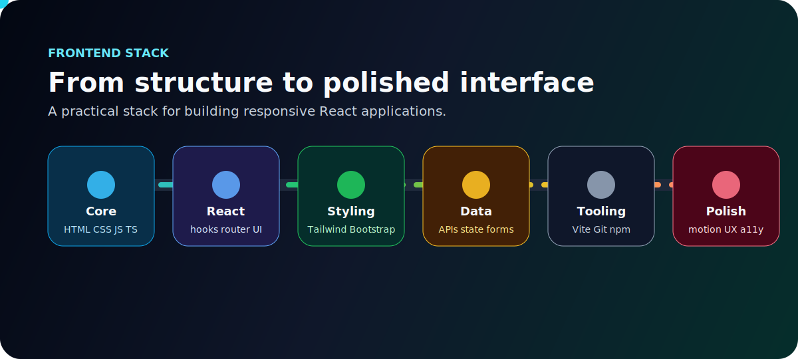
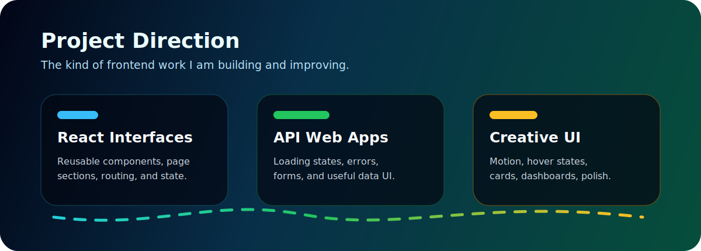
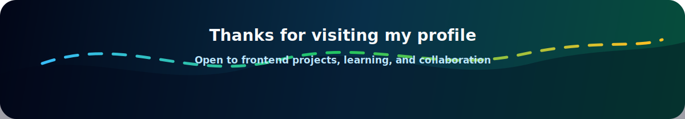

<!--
Profile README for Shivam Negi.
GitHub username: shivam01112
Tip: add your real portfolio, LinkedIn, and email links in the Connect section.
-->

  

  

 

  

## Skill Lab

  

## Frontend Stack

  

## Project Direction

  

## Contribution Snake

  <picture>
    <source media="(prefers-color-scheme: dark)" srcset="./assets/github-contribution-snake-dark.svg" />
    <source media="(prefers-color-scheme: light)" srcset="./assets/github-contribution-snake.svg" />
    
  </picture>

## Connect

  
  
  
  

 

  

