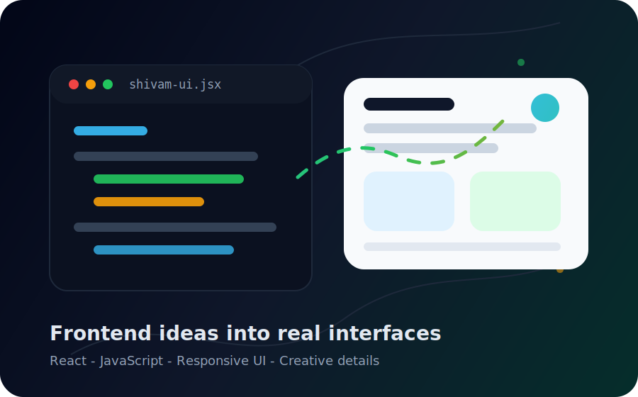

<!--
Profile README for Shivam Negi.
To publish as your GitHub profile, put this README in a repository with the exact same name as your GitHub username.
The contribution snake below is generated automatically by .github/workflows/snake.yml after GitHub Actions runs.
-->

  

  

<table>
  <tr>
    <td width="58%">
      <h2>Frontend Developer</h2>
      

        I am Shivam Negi, a frontend developer focused on building modern, responsive,
        and user-friendly web experiences. I like clean UI, smooth interactions, and code
        that stays easy to understand after the project grows.
      

      

        <b>Focus:</b> React, JavaScript, responsive layouts, component-based UI, API integration,
        and polished frontend details.
      

    </td>
    <td width="42%">
      
    </td>
  </tr>
</table>

## What I Do

<table>
  <tr>
    <td width="33%">
      <h3>React UI</h3>
      
Reusable components, clean state flow, hooks, props, routing, and scalable page structure.

    </td>
    <td width="33%">
      <h3>Responsive Design</h3>
      
Layouts that feel natural on mobile, tablet, and desktop with careful spacing and hierarchy.

    </td>
    <td width="33%">
      <h3>Frontend Polish</h3>
      
Animations, hover states, loading states, empty states, forms, and small UX details that matter.

    </td>
  </tr>
</table>

## Skills

  

 

  
  
  
  
  

## Creative Frontend Stack

| Area | Tools And Skills |
| --- | --- |
| Core frontend | HTML, CSS, JavaScript, TypeScript |
| Framework | React, React Router, reusable components |
| Styling | Tailwind CSS, Bootstrap, responsive design |
| State and data | Hooks, Context API, Redux basics, REST APIs |
| Tooling | Vite, npm, Git, GitHub, VS Code |
| Design sense | Layout, spacing, color, accessibility, micro-interactions |

## Project Showcase

<table>
  <tr>
    <td width="50%">
      <h3>Interactive React Interfaces</h3>
      

        Component-driven pages with smooth navigation, reusable UI blocks,
        and responsive layouts for real users.
      

      
<b>Best for:</b> portfolio apps, dashboards, landing pages, and product UI.

    </td>
    <td width="50%">
      <h3>API Connected Web Apps</h3>
      

        Frontend projects that connect with APIs, handle loading and error states,
        and present data in a clear visual structure.
      

      
<b>Best for:</b> weather apps, ecommerce UI, admin panels, and search tools.

    </td>
  </tr>
</table>

## Contribution Snake

  <picture>
    <source media="(prefers-color-scheme: dark)" srcset="./assets/github-contribution-snake-dark.svg" />
    <source media="(prefers-color-scheme: light)" srcset="./assets/github-contribution-snake.svg" />
    
  </picture>

## Current Goals

- Build more polished React projects
- Improve frontend architecture and performance
- Practice clean UI design and better accessibility
- Create useful web apps that solve real problems

## Connect With Me

<!-- Replace # with your real portfolio, LinkedIn, and email links. -->

  
  
  

  

