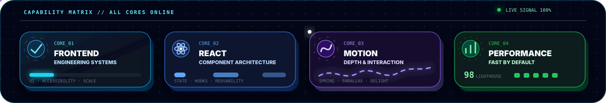
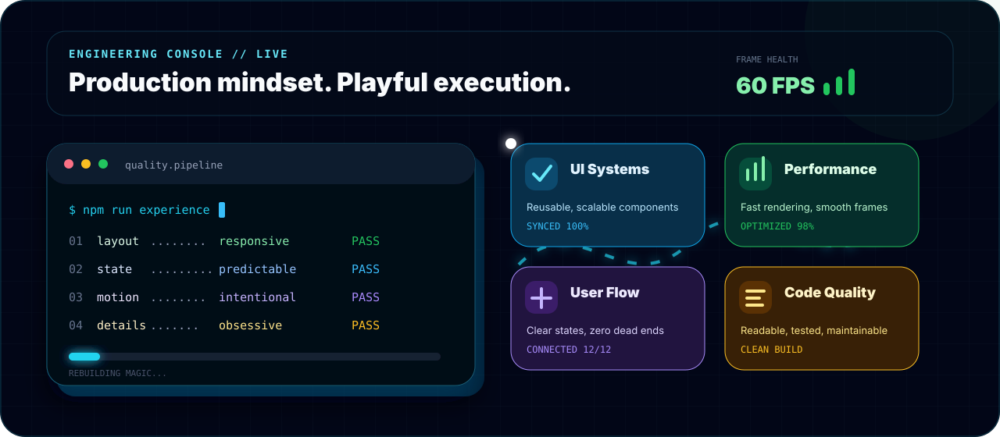
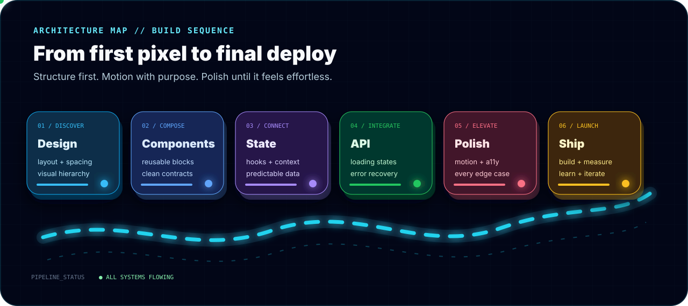
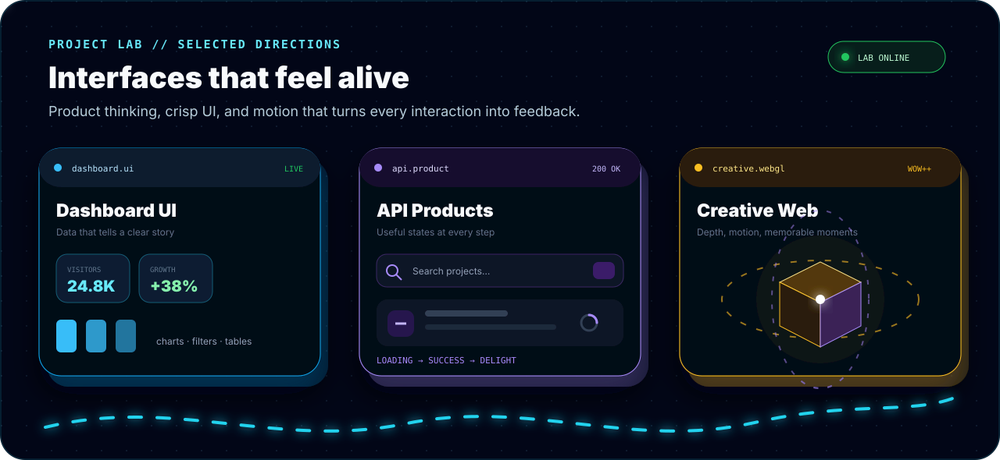

<!--
Shivam Negi - GitHub profile README
Username: shivam01112
Live sections are refreshed by .github/workflows/profile-metrics.yml.
-->
<!-- 

  

 -->

  

  

  
  

 

  

 

  

 

  

 

  

 

  

 

  

 

  <h2>⚡ Live GitHub Signals</h2>
  REAL ACTIVITY &nbsp;•&nbsp; CODE VELOCITY &nbsp;•&nbsp; BUILD CONSISTENCY

  
  

 

  <a href="https://github.com/shivam01112">
    
  </a>
  <a href="https://github.com/shivam01112?tab=repositories">
    
  </a>

 

  <a href="https://github.com/shivam01112">
    
  </a>

 

  

 

  📡 REAL DATA &nbsp;•&nbsp; SOURCED LIVE FROM THE GITHUB GRAPHQL API &nbsp;•&nbsp; REFRESHED 4X DAILY
    
  

 

### 🚀 Recent public work

<!--START_SECTION:activity-->
1. Pushed updates to [`shivam01112/Iron-Man-X-Shivam`](https://github.com/shivam01112/Iron-Man-X-Shivam)
2. Pushed updates to [`shivam01112/shivam01112`](https://github.com/shivam01112/shivam01112)
3. Merged PR [#4 — pull request](https://github.com/shivam01112/Iron-Man-X-Shivam/pull/4) in [`shivam01112/Iron-Man-X-Shivam`](https://github.com/shivam01112/Iron-Man-X-Shivam)
4. Opened PR [#4 — pull request](https://github.com/shivam01112/Iron-Man-X-Shivam/pull/4) in [`shivam01112/Iron-Man-X-Shivam`](https://github.com/shivam01112/Iron-Man-X-Shivam)
5. Merged PR [#3 — pull request](https://github.com/shivam01112/Iron-Man-X-Shivam/pull/3) in [`shivam01112/Iron-Man-X-Shivam`](https://github.com/shivam01112/Iron-Man-X-Shivam)
<!--END_SECTION:activity-->

 

  <picture>
    <source media="(prefers-color-scheme: dark)" srcset="./assets/github-contribution-snake-dark.svg" />
    <source media="(prefers-color-scheme: light)" srcset="./assets/github-contribution-snake.svg" />
    
  </picture>

 

  <a href="https://github.com/shivam01112">
    
  </a>

 

  

  

