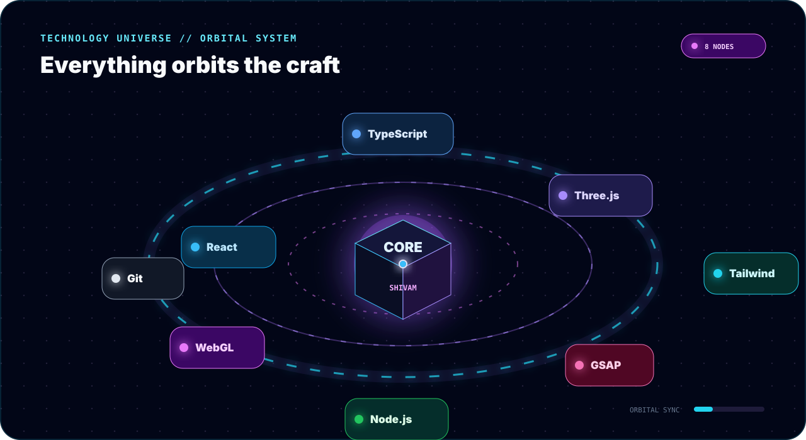
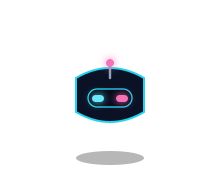

<!--
  Shivam Negi — GitHub profile README
  Username: shivam01112
  Live sections are refreshed by .github/workflows/profile-metrics.yml — do not hand-edit
  the auto-generated stat/streak/language/snake/weekly-chart assets, they are overwritten.
-->

  

  

  
  

 

  

 

  

 

  

  
  <b>01 Dashboard UI</b> — <a href="https://github.com/shivam01112">Live Demo</a> · <a href="https://github.com/shivam01112?tab=repositories">Source</a>
  &nbsp;&nbsp;|&nbsp;&nbsp;
  <b>02 API Products</b> — <a href="https://github.com/shivam01112">Live Demo</a> · <a href="https://github.com/shivam01112?tab=repositories">Source</a>
  &nbsp;&nbsp;|&nbsp;&nbsp;
  <b>03 Creative Web</b> — <a href="https://github.com/shivam01112">Live Demo</a> · <a href="https://github.com/shivam01112?tab=repositories">Source</a>
  

 

  

 

  

 

  

 

  

 

  

 

  <h2>⚡ Live GitHub Signals</h2>
  REAL ACTIVITY &nbsp;•&nbsp; CODE VELOCITY &nbsp;•&nbsp; BUILD CONSISTENCY

  
  

 

  
  

 

  

### 🚀 Recent public work

<!--START_SECTION:activity-->
1. Pushed updates to [`shivam01112/my-first-project`](https://github.com/shivam01112/my-first-project)
2. Pushed updates to [`shivam01112/saitronics`](https://github.com/shivam01112/saitronics)
3. Created branch `shivam01112-patch-4` in [`shivam01112/my-first-project`](https://github.com/shivam01112/my-first-project)
4. Created branch `shivam01112-patch-3` in [`shivam01112/my-first-project`](https://github.com/shivam01112/my-first-project)
5. Merged PR [#5 — pull request](https://github.com/shivam01112/my-first-project/pull/5) in [`shivam01112/my-first-project`](https://github.com/shivam01112/my-first-project)
<!--END_SECTION:activity-->

 

  <h2>📡 Contribution Visualization</h2>
  SOURCED LIVE FROM THE GITHUB GRAPHQL API &nbsp;•&nbsp; REFRESHED 4X DAILY

  

 

  

 

  <picture>
    <source media="(prefers-color-scheme: dark)" srcset="./assets/github-contribution-snake-dark.svg" />
    <source media="(prefers-color-scheme: light)" srcset="./assets/github-contribution-snake.svg" />
    
  </picture>

 

  

 

  

  
  
  
  

 

  
   
  you found the companion. it's watching the build with you.

  

